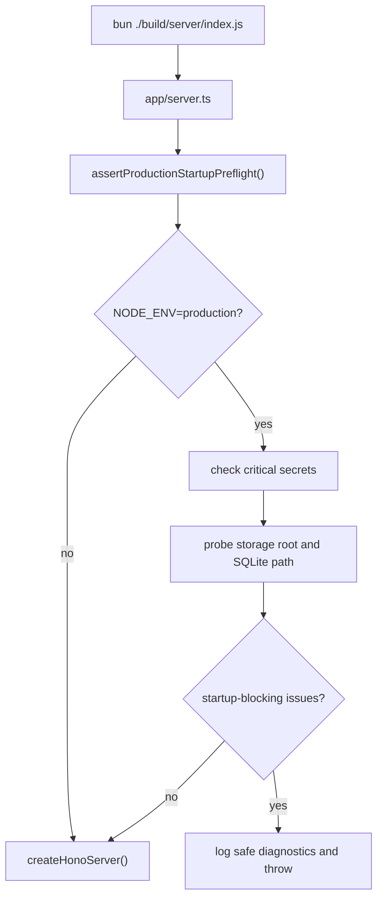
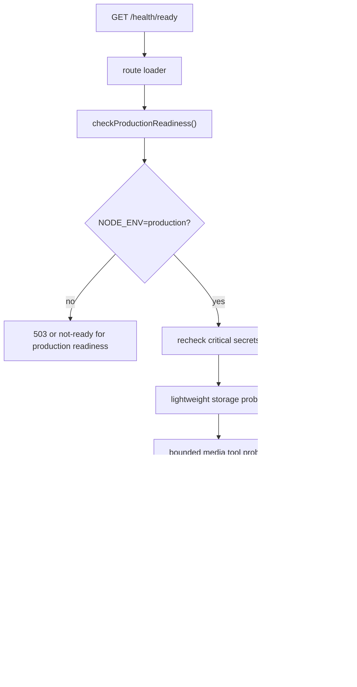

# Production Startup Preflight Implementation Plan

> **For Claude:** REQUIRED SUB-SKILL: Use superpowers:executing-plans to implement this plan task-by-task.

**Goal:** Add production startup and readiness preflight so Docker Compose cannot report a full-vault production deployment as healthy when required app-owned prerequisites are missing.

**Architecture:** Add a small active-owned runtime module for production/readiness policy, filesystem probes, and media-tool probes. Wire it through `app/composition/server/*`, keep `app/routes/*` thin, and run startup hard-fail checks from `app/server.ts` before creating the Bun/Hono server.

**Tech Stack:** Bun 1.3.5, TypeScript, React Router v7 file routes, react-router-hono-server Bun adapter, Hono server runtime, SQLite/libsql, FFmpeg/ffprobe/Shaka Packager, Vitest, Bun smoke tests, Docker Compose.

---

## 1. Implementation Goal

Implement the product and test contracts defined by:

- `docs/plans/2026-05-02-production-startup-preflight-product-spec.md`
- `docs/plans/2026-05-02-production-startup-preflight-test-spec.md`

The implementation must make these production deployment states observable and deterministic:

- missing or blank critical production secrets fail startup
- unusable storage or primary SQLite path fails startup
- unavailable or non-runnable media tools fail readiness and Docker health
- `GET /health/ready` is public-safe and returns only `204` or `503`
- Dockerfile and Compose healthchecks use `/health/ready`

## 2. Scope And Non-Scope

### In Scope

- Production-only startup preflight under `NODE_ENV=production`.
- Critical secret presence checks for:
  - `AUTH_SHARED_PASSWORD`
  - `VIDEO_JWT_SECRET`
  - `VIDEO_MASTER_ENCRYPTION_SEED`
- Storage write/delete probes for configured storage root and primary SQLite database parent/path.
- Startup validation that the primary SQLite database can be opened and migrated through the existing storage path.
- Readiness-time lightweight storage recheck.
- Readiness validation for `ffmpeg`, `ffprobe`, and Shaka Packager.
- Public-safe `GET /health/ready`.
- Dockerfile and Compose healthcheck updates.
- Docker-backed verification for the Docker Compose smoke contract.
- Deployment docs and env example alignment.

### Non-Scope

- No Caddy, Nginx, Traefik, ACME, or reverse-proxy examples.
- No HTTPS detection or startup failure for plain HTTP.
- No Docker secrets, secret-manager, Vault, SOPS, or encrypted config integration.
- No runtime entropy, length, placeholder, or format enforcement for secrets.
- No `KEY_SALT_PREFIX` requirement.
- No FFmpeg/Shaka version pinning or checksum verification.
- No playback JWT request-log redaction.
- No production hydration warning investigation.
- No browser UI changes unless implementation accidentally touches browser-visible route wiring.

## 3. Codebase Survey Results

### Project Structure

- `app/routes/*`: React Router route adapters. Existing route files are thin and delegate to composition or modules.
- `app/composition/server/*`: canonical server-side dependency assembly. Routes should consume this layer instead of constructing repositories, DB adapters, FFmpeg services, or DRM services directly.
- `app/modules/*`: active source-of-truth backend modules. Current bounded contexts include `auth`, `storage`, `ingest`, `library`, `playback`, `playlist`, and `thumbnail`.
- `app/shared/config/*`: raw runtime config helpers for auth, playback, storage paths, and media tool resolution.
- `tests/integration/*`: Node/Vitest integration tests for routes, composition, config, storage, and smoke contracts.
- `tests/smoke/*`: Bun runtime smoke tests that spawn the built server with hermetic env.
- `scripts/*`: verification scripts and runtime helper scripts.

### Existing Architecture And Patterns

- The current target architecture requires `app/routes` to stay thin and `app/composition/server` to own server-side wiring.
- New backend source-of-truth code belongs under `app/modules`, not under a revived legacy or ad hoc shared folder.
- Existing modules use simple use-case/adapter boundaries, explicit dependency injection for tests, and no heavyweight DI container.
- Runtime-sensitive tests must be hermetic and must not depend on `.env`.
- `bun run verify:base` is the base verification authority.
- Runtime-sensitive auth/playback/storage changes require Docker CI-like verification per `docs/verification-contract.md`.

### Relevant Existing Code Paths

- `app/server.ts`
  - Current Bun production entrypoint generated for `react-router-hono-server`.
  - Exports `await createHonoServer()`.
  - Best startup hook location because it runs before the Hono server is returned.

- `app/routes.ts`
  - Uses `flatRoutes()` from `@react-router/fs-routes`.
  - A new `app/routes/health.ready.ts` file maps to `/health/ready`.

- `app/shared/config/auth.server.ts`
  - `getAuthRuntimeState()` already trims and presence-checks `AUTH_SHARED_PASSWORD`.
  - `getAuthCookieConfig()` already makes cookies secure when `NODE_ENV=production`.

- `app/shared/config/playback.server.ts`
  - `getPlaybackConfig()` already requires trimmed `VIDEO_JWT_SECRET`, but only when playback token code is exercised.

- `app/modules/playback/infrastructure/license/derive-playback-encryption-key.ts`
  - Requires `VIDEO_MASTER_ENCRYPTION_SEED` when key derivation is exercised.
  - Does not enforce entropy or format, which matches the product policy.

- `app/modules/storage/infrastructure/config/storage-config.server.ts`
  - Canonical storage config.
  - Resolves `STORAGE_DIR`, `DATABASE_SQLITE_PATH`, `storageDir`, `stagingDir`, `stagingTempDir`, `videosDir`.

- `app/modules/storage/infrastructure/sqlite/migrated-primary-sqlite.database.ts`
  - Existing canonical path to open the primary SQLite database and run migrations.
  - Startup preflight should reuse this instead of inventing another SQLite opener.

- `app/shared/config/video-tools.server.ts`
  - Existing media-tool resolution for `FFMPEG_PATH`, `FFPROBE_PATH`, `SHAKA_PACKAGER_PATH`, local `binaries/*`, and system fallback.
  - Current behavior ignores stale explicit paths for some tools. This must change so explicit path env vars are authoritative.

- `app/shared/lib/server/ffmpeg-process-manager.server.ts`
  - Existing command runner for media preparation.
  - Do not reuse directly for readiness probes because it is queue-oriented and FFmpeg-named. The readiness module should use a small injected command probe for bounded `-version`/no-op checks.

- `Dockerfile`
  - Currently healthchecks `http://localhost:3000/`.
  - Must change to `/health/ready` and use a timeout compatible with bounded readiness checks.

- `docker-compose.yaml`
  - Currently healthchecks `/`.
  - Must change to `/health/ready`.
  - Keep default `3000:3000`.

### Existing Test Utilities To Reuse

- `tests/support/create-runtime-test-env.ts`
  - Builds hermetic runtime env and scrubs ambient auth/playback secrets.
  - Extend tests around it if new production env helpers are needed.

- `tests/support/create-runtime-test-workspace.ts`
  - Creates temp storage and database paths for runtime tests.
  - Reuse for readiness route/process tests where a seeded workspace is helpful.

- `tests/smoke/bun-auth-gate.test.ts`
  - Existing pattern for spawning built Bun server and capturing logs.
  - Reuse the same style for any server-level smoke additions.

- `tests/integration/shared/storage-paths.server.test.ts`
  - Existing env restore and temp path pattern for storage config tests.

- `tests/integration/shared/video-tools.server.test.ts`
  - Existing media tool config tests. Update expectations for authoritative explicit paths.

### Paths Not To Bypass

- Do not read storage env directly in routes. Use `getPrimaryStorageConfig()`.
- Do not open SQLite through a new raw client in preflight. Use `createMigratedPrimarySqliteDatabase()`.
- Do not construct readiness logic inside `app/routes/health.ready.ts`. Use `app/composition/server/runtime-readiness.ts`.
- Do not keep Docker healthchecks on `/`, `/login`, `/api/auth/me`, or any protected route.
- Do not depend on `.env` in tests. Use explicit env objects, generated env files, or `--no-env-file`.

## 4. Implementation Design

### New Runtime Module

Create a small runtime module:

```text
app/modules/runtime/
  application/
    production-readiness.policy.ts
    production-readiness.policy.test.ts
  infrastructure/
    filesystem-runtime-probes.server.ts
    filesystem-runtime-probes.server.test.ts
    media-tool-runtime-probes.server.ts
    media-tool-runtime-probes.server.test.ts
```

Responsibilities:

- classify production vs non-production
- collect critical secret presence failures
- represent startup-blocking and readiness-only issues
- run filesystem probes against configured storage paths
- run bounded media tool probes
- build a readiness report that the composition root can log and expose safely

Keep this module small. Do not create a generalized observability framework.

### Composition Root

Create:

```text
app/composition/server/runtime-readiness.ts
```

Responsibilities:

- assemble runtime readiness dependencies from existing config helpers
- expose `assertProductionStartupPreflight()`
- expose `checkProductionReadiness()`
- log operator-facing startup/readiness failures without printing secret values
- optionally dedupe repeated readiness failure logs by issue signature to avoid healthcheck log spam

Routes and `app/server.ts` should call this composition file, not the individual probes.

### Startup Control Flow



Startup preflight must not run media tool checks as startup hard failures. Media tools are readiness-only.

### Readiness Control Flow



Non-production should not claim production readiness. Return `503` for `/health/ready` unless production checks pass.

### Public Response Contract

`app/routes/health.ready.ts` should return:

```ts
return new Response(null, { status: report.ready ? 204 : 503 });
```

No JSON body. No key names. No category names. No paths.

### Operator Diagnostics

Log details only to container logs:

- missing secret key names are allowed
- secret values are never logged
- storage/database/media categories are allowed in logs
- detailed local paths should be avoided when not necessary; use category and config key names first
- media tool names are allowed

Use concise messages such as:

```text
Production startup preflight failed: missing required env AUTH_SHARED_PASSWORD, VIDEO_JWT_SECRET
Production startup preflight failed: storage readiness check failed for STORAGE_DIR
Production readiness failed: media tool ffmpeg is unavailable
```

## 5. Technical Decisions

### Timeout Values

Use these implementation constants:

- storage probe timeout: `2_000ms`
- per media tool command timeout: `2_000ms`
- Docker healthcheck timeout: `10s`
- Docker contract-test health polling timeout: `90s`

Reasoning:

- `ffmpeg -version`, `ffprobe -version`, and `packager --version` should complete quickly when installed correctly.
- 2 seconds is enough for ordinary Docker startup variance while still detecting broken tools quickly.
- Docker healthcheck timeout must be larger than one probe timeout because readiness runs multiple checks.
- 90 seconds gives image/container startup room without making local verification hang indefinitely.

Run media tool probes concurrently so three 2-second command limits do not become a 6-second happy-path cost.

### Media Tool Resolution

Modify `app/shared/config/video-tools.server.ts` so explicit non-blank env vars are authoritative:

- `FFMPEG_PATH=/missing/ffmpeg` returns `/missing/ffmpeg`
- `FFPROBE_PATH=/missing/ffprobe` returns `/missing/ffprobe`
- `SHAKA_PACKAGER_PATH=/missing/packager` returns `/missing/packager`

Local `binaries/*` and system fallback remain unchanged when explicit env vars are absent.

This aligns readiness and actual media execution. A stale explicit path should fail instead of silently falling back to another binary.

### Storage Probes

Use app-owned sentinel files:

- storage root sentinel: `<storageDir>/.local-streamer-storage-ready`
- database parent sentinel: `<dirname(databasePath)>/.local-streamer-db-ready`

Probe steps:

1. `mkdir` the target directory with `{ recursive: true }`.
2. Confirm a blocking regular-file conflict is surfaced as failure.
3. Write a small sentinel with random content.
4. Read or stat the sentinel if useful.
5. Delete the sentinel in a `finally` block.

Startup should additionally call `createMigratedPrimarySqliteDatabase({ dbPath })` so database open/migration failures are caught before the app listens.

Readiness should use lightweight filesystem probes and avoid re-running migrations on every healthcheck.

### Docker Verification Command

Add a dedicated Docker-backed command:

```json
"verify:docker-compose-smoke": "LOCAL_STREAMER_DISABLE_VITE_ENV_FILES=true bun --no-env-file ./scripts/verify-docker-compose-smoke.ts"
```

Do not add this to `verify:base`. It requires Docker and is runtime/deployment-sensitive, not a base unit/integration gate.

Update `docs/verification-contract.md` to list it as the targeted Docker deployment-readiness gate for this feature, alongside the existing CI-faithful Docker authorities.

### CI Wiring Decision

Wire `verify:docker-compose-smoke` into CI immediately as a separate Docker-focused workflow, not as part of `verify:base`.

Practical external patterns support this shape:

- GitHub Actions documents Docker service containers as a normal integration-test mechanism and emphasizes fresh per-job service containers that are destroyed when the job completes.
- Docker Compose officially supports health-driven waiting through `docker compose up --wait` and `--wait-timeout`.
- The FastAPI full-stack template runs Docker Compose Playwright tests on `push`, `pull_request`, and `workflow_dispatch`, but gates the expensive job behind path filtering for backend/frontend/env/Compose/workflow changes.
- Cloud Posse and Marketplace Docker Compose test actions exist specifically to start Compose stacks, run tests inside containers, and clean up afterward.

For this repo, the implementation should add a CI job to `.github/workflows/ci.yml` that runs on the existing `push` and `pull_request` workflow triggers but self-skips unless relevant files changed. Relevant paths:

- `app/server.ts`
- `app/routes/health.ready.ts`
- `app/composition/server/runtime-readiness.ts`
- `app/modules/runtime/**`
- `app/shared/config/auth.server.ts`
- `app/shared/config/playback.server.ts`
- `app/shared/config/video-tools.server.ts`
- `app/modules/storage/**`
- `Dockerfile`
- `docker-compose.yaml`
- `scripts/verify-docker-compose-smoke.ts`
- `package.json`
- `bun.lock`
- `.github/workflows/ci.yml`

Use a first-party changed-files shell step or a well-pinned paths-filter action. Keep `workflow_dispatch` available if the workflow is later split or made manually triggerable.

This closes the original regression class in CI without making every documentation-only or UI-only PR pay the Docker Compose cost.

## 6. Major File Changes

### Create

- `app/modules/runtime/application/production-readiness.policy.ts`
- `app/modules/runtime/application/production-readiness.policy.test.ts`
- `app/modules/runtime/infrastructure/filesystem-runtime-probes.server.ts`
- `app/modules/runtime/infrastructure/filesystem-runtime-probes.server.test.ts`
- `app/modules/runtime/infrastructure/media-tool-runtime-probes.server.ts`
- `app/modules/runtime/infrastructure/media-tool-runtime-probes.server.test.ts`
- `app/composition/server/runtime-readiness.ts`
- `app/routes/health.ready.ts`
- `tests/integration/runtime/production-readiness-route.test.ts`
- `tests/integration/runtime/production-startup-preflight.test.ts`
- `tests/integration/smoke/production-readiness-config-contract.test.ts`
- `scripts/verify-docker-compose-smoke.ts`

### Modify

- `app/server.ts`
- `app/shared/config/video-tools.server.ts`
- `tests/integration/shared/video-tools.server.test.ts`
- `Dockerfile`
- `docker-compose.yaml`
- `.github/workflows/ci.yml`
- `.env.example`
- `README.md`
- `docs/current-runtime-documentation-spec.md`
- `docs/verification-contract.md`
- `package.json`

## 7. Test Implementation Plan

### Unit Tests

Add module tests under `app/modules/runtime/**`.

Required cases:

- `NODE_ENV=production` enables strict checks.
- non-production does not apply production startup hard-fail rules.
- missing and whitespace critical secrets produce startup-blocking issues.
- multiple missing critical secrets are reported together.
- short, weak-looking, or example-looking non-blank secrets are accepted.
- storage probe success/failure maps to startup-blocking storage/database issues.
- media tool missing/non-runnable maps to readiness-only issues.
- explicit media paths are authoritative.

### Integration Tests

Add tests under `tests/integration/runtime/**`.

Required cases:

- `assertProductionStartupPreflight()` rejects in production when each critical secret is missing.
- startup preflight rejects when `STORAGE_DIR` is blocked by a regular file.
- startup preflight rejects when `DATABASE_SQLITE_PATH` parent/path is blocked.
- `/health/ready` returns `204` for a configured production readiness report.
- `/health/ready` returns `503` for readiness failures.
- `/health/ready` response body does not include secret names, secret values, local paths, or diagnostic categories.
- readiness changes from ready to not ready when storage probes begin failing after startup.

Use dependency injection in `createRuntimeReadinessServices()` so route tests can stub reports without manipulating real Docker.

### Existing Config Tests

Update `tests/integration/shared/video-tools.server.test.ts`:

- stale explicit `FFMPEG_PATH` returns that explicit path
- stale explicit `FFPROBE_PATH` returns that explicit path
- stale explicit `SHAKA_PACKAGER_PATH` returns that explicit path
- local binary fallback still works when explicit env is absent

### Docker Contract Verification

Add `scripts/verify-docker-compose-smoke.ts`.

The script should:

- create a temporary directory
- generate a standalone Compose file without `container_name`, `env_file`, fixed host ports, or repo-local storage
- build the production image from the current repo
- run four scenarios with isolated Compose project names:
  - configured production becomes healthy
  - missing critical secret never becomes healthy and logs name the missing key
  - unusable storage never becomes healthy and logs storage/database category
  - explicit missing media tool keeps the container running but makes health unhealthy
- always run `docker compose down -v --remove-orphans` in cleanup
- never use the developer's real `.env`

The generated Compose service should avoid host ports. Check readiness from inside the container with Docker health status and, when needed, `docker compose exec` against `http://localhost:3000/health/ready`.

### Documentation Contract Tests

Add or extend integration smoke tests so they verify:

- Dockerfile healthcheck uses `/health/ready`
- `docker-compose.yaml` healthcheck uses `/health/ready`
- Docker Compose default port binding remains `3000:3000`
- no default Caddy/Nginx/Traefik service was added
- docs mention the three required production secrets
- docs describe `VIDEO_MASTER_ENCRYPTION_SEED` preservation with storage/database backup
- docs do not make `KEY_SALT_PREFIX` required

## 8. Migration And Compatibility Considerations

- Existing development auth-only flows must still work when `NODE_ENV` is not `production`.
- Existing smoke helpers already provide playback secrets by default; do not remove those defaults.
- Existing Docker deployments with blank `.env` critical secrets will fail earlier after this change. That is intended.
- Existing deployments that set stale explicit media paths will become not-ready instead of silently using fallback binaries. That is intended.
- Existing `STORAGE_DIR` and `DATABASE_SQLITE_PATH` semantics remain unchanged.
- `KEY_SALT_PREFIX` remains optional.
- Default Compose `3000:3000` remains unchanged.

## 9. Risks And Mitigations

- **Risk:** Startup preflight mutates storage unexpectedly.
  - **Mitigation:** Only use app-owned sentinel files and existing SQLite migration/open path. Do not write under `storage/videos`.

- **Risk:** Readiness endpoint leaks diagnostic detail.
  - **Mitigation:** Route returns empty `204`/`503` only. Put diagnostics in logs and test for absence of secret names, paths, and categories in response body.

- **Risk:** Healthchecks become flaky because media probes are slow.
  - **Mitigation:** Run media probes concurrently, set per-tool timeout to 2 seconds, and Docker healthcheck timeout to 10 seconds.

- **Risk:** Docker contract tests leave containers or volumes behind.
  - **Mitigation:** Use unique Compose project names and `finally` cleanup with `docker compose down -v --remove-orphans`.

- **Risk:** `react-router-hono-server` generated `app/server.ts` comment suggests generated ownership.
  - **Mitigation:** Keep the file small and explicit: run preflight, then call `createHonoServer()`. The package supports custom server options and default export from `app/server.ts`.

- **Risk:** Repeated unhealthy healthchecks spam logs.
  - **Mitigation:** Dedupe readiness failure logs by a stable issue signature in the composition root.

## 10. Implementation Order

### Task 1: Add Runtime Policy Unit Tests

**Files:**

- Create: `app/modules/runtime/application/production-readiness.policy.test.ts`

**Steps:**

1. Write table-driven tests for production trigger and critical secret presence.
2. Include whitespace-only values.
3. Include short/weak-looking non-blank values and assert they pass.
4. Include expected startup-blocking vs readiness-only classification.
5. Run:

```bash
bun run test:modules -- app/modules/runtime/application/production-readiness.policy.test.ts
```

Expected before implementation: fail because module does not exist.

### Task 2: Implement Runtime Policy

**Files:**

- Create: `app/modules/runtime/application/production-readiness.policy.ts`

**Steps:**

1. Add `isProductionRuntime(env)` using `env.NODE_ENV === 'production'`.
2. Add critical secret key constants.
3. Add issue/report types.
4. Add secret collection and report aggregation helpers.
5. Ensure diagnostics include key names but never values.
6. Run Task 1 tests until green.

### Task 3: Add Filesystem Probe Tests

**Files:**

- Create: `app/modules/runtime/infrastructure/filesystem-runtime-probes.server.test.ts`

**Steps:**

1. Test writable storage root succeeds with a temp directory.
2. Test storage root blocked by a regular file fails.
3. Test database parent blocked by a regular file fails.
4. Test `DATABASE_SQLITE_PATH` override is checked separately from `STORAGE_DIR`.
5. Test sentinel cleanup.
6. Run:

```bash
bun run test:modules -- app/modules/runtime/infrastructure/filesystem-runtime-probes.server.test.ts
```

Expected before implementation: fail because module does not exist.

### Task 4: Implement Filesystem Probes

**Files:**

- Create: `app/modules/runtime/infrastructure/filesystem-runtime-probes.server.ts`

**Steps:**

1. Use `getPrimaryStorageConfig()` as the default config source.
2. Implement storage root write/delete sentinel probe.
3. Implement database parent write/delete sentinel probe.
4. Implement startup database open/migration probe through `createMigratedPrimarySqliteDatabase()`.
5. Add 2-second timeout wrapping around probe promises.
6. Run Task 3 tests until green.

### Task 5: Update Media Tool Resolution Tests

**Files:**

- Modify: `tests/integration/shared/video-tools.server.test.ts`

**Steps:**

1. Change stale explicit path expectations from fallback to explicit path.
2. Keep local binary fallback tests for absent explicit env.
3. Run:

```bash
bun run test:integration -- tests/integration/shared/video-tools.server.test.ts
```

Expected before implementation: fail on stale explicit path expectations.

### Task 6: Make Explicit Media Tool Paths Authoritative

**Files:**

- Modify: `app/shared/config/video-tools.server.ts`

**Steps:**

1. Add a small `readExplicitPath(value)` helper that trims and returns non-blank values.
2. Return explicit env paths before checking existence.
3. Preserve local `binaries/*` and system fallback behavior when explicit env is absent.
4. Run Task 5 tests until green.

### Task 7: Add Media Probe Tests

**Files:**

- Create: `app/modules/runtime/infrastructure/media-tool-runtime-probes.server.test.ts`

**Steps:**

1. Inject a fake command runner.
2. Test all tools runnable returns no readiness issue.
3. Test missing command error maps to the tool name.
4. Test non-zero/version failure maps to the tool name.
5. Test timeout maps to the tool name.
6. Test explicit stale path fails readiness instead of fallback.
7. Run:

```bash
bun run test:modules -- app/modules/runtime/infrastructure/media-tool-runtime-probes.server.test.ts
```

Expected before implementation: fail because module does not exist.

### Task 8: Implement Media Probes

**Files:**

- Create: `app/modules/runtime/infrastructure/media-tool-runtime-probes.server.ts`

**Steps:**

1. Resolve paths through `getFFmpegPath()`, `getFFprobePath()`, and `getShakaPackagerPath()`.
2. Run:
   - `ffmpeg -version`
   - `ffprobe -version`
   - `packager --version`
3. Use an injected runner for tests and `node:child_process` spawn for production.
4. Apply 2-second per-tool timeout.
5. Run probes concurrently.
6. Return readiness-only issues with tool names and no secret values.
7. Run Task 7 tests until green.

### Task 9: Add Composition And Route Tests

**Files:**

- Create: `tests/integration/runtime/production-readiness-route.test.ts`
- Create: `tests/integration/runtime/production-startup-preflight.test.ts`

**Steps:**

1. Mock or inject runtime readiness service for route tests.
2. Assert `/health/ready` loader returns `204` with empty body for ready.
3. Assert it returns `503` with empty body for not-ready.
4. Assert response text does not contain secret key names, values, local paths, or category names.
5. Test `assertProductionStartupPreflight()` rejects for missing secrets.
6. Test startup rejects for blocked storage and blocked DB path.
7. Run:

```bash
bun run test:integration -- tests/integration/runtime/production-readiness-route.test.ts tests/integration/runtime/production-startup-preflight.test.ts
```

Expected before implementation: fail because route/composition files do not exist.

### Task 10: Implement Composition And Health Route

**Files:**

- Create: `app/composition/server/runtime-readiness.ts`
- Create: `app/routes/health.ready.ts`

**Steps:**

1. Assemble policy, filesystem probes, and media probes in the composition root.
2. Export `assertProductionStartupPreflight()`.
3. Export `checkProductionReadiness()`.
4. Add safe logging for startup failures.
5. Add deduped safe logging for readiness failures.
6. Add route loader that returns `new Response(null, { status })`.
7. Run Task 9 tests until green.

### Task 11: Wire Startup Preflight

**Files:**

- Modify: `app/server.ts`

**Steps:**

1. Import `assertProductionStartupPreflight` from `~/composition/server/runtime-readiness`.
2. Await it before `createHonoServer()`.
3. Keep `createHonoServer()` as the default exported server.
4. Run:

```bash
bun run typecheck
bun run build
```

Expected: both pass.

### Task 12: Update Docker Healthchecks And Config Contract Tests

**Files:**

- Modify: `Dockerfile`
- Modify: `docker-compose.yaml`
- Create: `tests/integration/smoke/production-readiness-config-contract.test.ts`

**Steps:**

1. Change Dockerfile healthcheck fetch target to `http://localhost:3000/health/ready`.
2. Change Dockerfile healthcheck timeout to `10s`.
3. Change Compose healthcheck fetch target to `http://localhost:3000/health/ready`.
4. Keep Compose `3000:3000`.
5. Add tests that read Dockerfile and Compose and assert the healthcheck and port contract.
6. Run:

```bash
bun run test:integration -- tests/integration/smoke/production-readiness-config-contract.test.ts
```

Expected: pass after config update.

### Task 13: Add Docker Compose Preflight Verification Script

**Files:**

- Create: `scripts/verify-docker-compose-smoke.ts`
- Modify: `package.json`
- Modify: `docs/verification-contract.md`
- Modify: `.github/workflows/ci.yml`

**Steps:**

1. Add a Bun script that shells out to `docker compose`.
2. Generate a temp standalone Compose file per run.
3. Use isolated project names and temp host storage directories.
4. Implement four scenarios:
   - valid production becomes healthy
   - missing secret does not become healthy
   - blocked storage does not become healthy
   - explicit missing media tool becomes unhealthy
5. Add the package script `verify:docker-compose-smoke`.
6. Document it in `docs/verification-contract.md`.
7. Add a separate path-scoped CI workflow that runs `bun run verify:docker-compose-smoke` only when relevant runtime/Docker files changed.
8. Run:

```bash
bun run verify:docker-compose-smoke
```

Expected: pass when Docker is available.

### Task 14: Update Deployment Documentation

**Files:**

- Modify: `.env.example`
- Modify: `README.md`
- Modify: `docs/current-runtime-documentation-spec.md`

**Steps:**

1. Clarify that production full-vault startup requires all three critical secrets.
2. Clarify that `VIDEO_MASTER_ENCRYPTION_SEED` must be backed up with storage and the primary SQLite database.
3. Keep `KEY_SALT_PREFIX` optional and document preservation only if customized.
4. Clarify that HTTPS/reverse proxy is operator-owned and not enforced by app preflight.
5. Clarify that default `3000:3000` is reachability, not complete remote production hardening.

### Task 15: Run Focused Verification

Run:

```bash
bun run test:modules -- app/modules/runtime
bun run test:integration -- tests/integration/runtime tests/integration/shared/video-tools.server.test.ts tests/integration/smoke/production-readiness-config-contract.test.ts
bun run typecheck
bun run build
```

Expected: all pass.

### Task 16: Run Required Final Verification

Run:

```bash
bun run verify:base
bun run verify:docker-compose-smoke
```

Because this touches runtime-sensitive startup, storage, playback prerequisites, and Docker health behavior, also run the existing Docker authority if practical:

```bash
bun run verify:ci-worktree:docker
```

If route wiring or browser-visible behavior changes unexpectedly, run:

```bash
bun run verify:e2e-smoke
```

Browser MCP/manual QA is not required unless implementation changes login, protected navigation, player route behavior, or playback request wiring beyond readiness/startup surfaces.

## 11. Success Conditions

- Production startup fails before listening when any critical secret is missing or blank.
- Production startup fails before listening when storage root or primary SQLite path is unusable.
- `/health/ready` returns `204` only when production readiness passes.
- `/health/ready` returns `503` with no diagnostic body when readiness fails.
- Missing or non-runnable media tools make readiness fail and Docker health unhealthy.
- Dockerfile and Compose healthchecks use `/health/ready`.
- Docker Compose contract verification proves configured, missing-secret, unusable-storage, and missing-media-tool scenarios.
- Existing non-production auth-only workflows remain possible.
- Existing smoke tests remain hermetic and independent from ambient `.env`.
- Required docs and examples align with the production full-vault contract.

## 12. Verification Commands

Minimum required after implementation:

```bash
bun run verify:base
bun run verify:docker-compose-smoke
```

Runtime-sensitive Docker authority:

```bash
bun run verify:ci-worktree:docker
```

Storage-sensitive optional authority if implementation changes data-integrity behavior beyond probes:

```bash
bun run verify:data-integrity
```

Browser-visible fallback only if touched:

```bash
bun run verify:e2e-smoke
```

## 13. Open Questions

No product-policy questions remain open.

Implementation defaults are selected in this plan:

- storage probe timeout: `2_000ms`
- per media tool timeout: `2_000ms`
- Docker healthcheck timeout: `10s`
- Docker contract-test polling timeout: `90s`
- dedicated Docker command: `bun run verify:docker-compose-smoke`
- CI wiring: add `verify:docker-compose-smoke` immediately as a separate, path-scoped Docker CI workflow. Do not put it inside `verify:base`.
